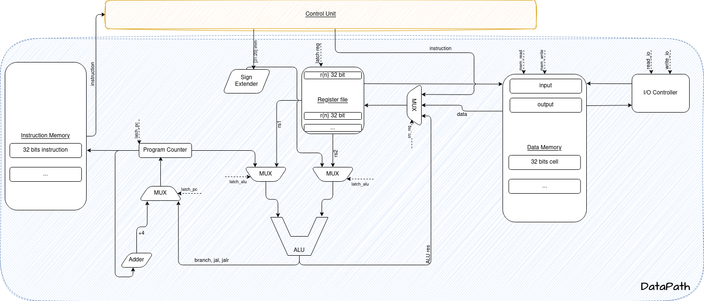
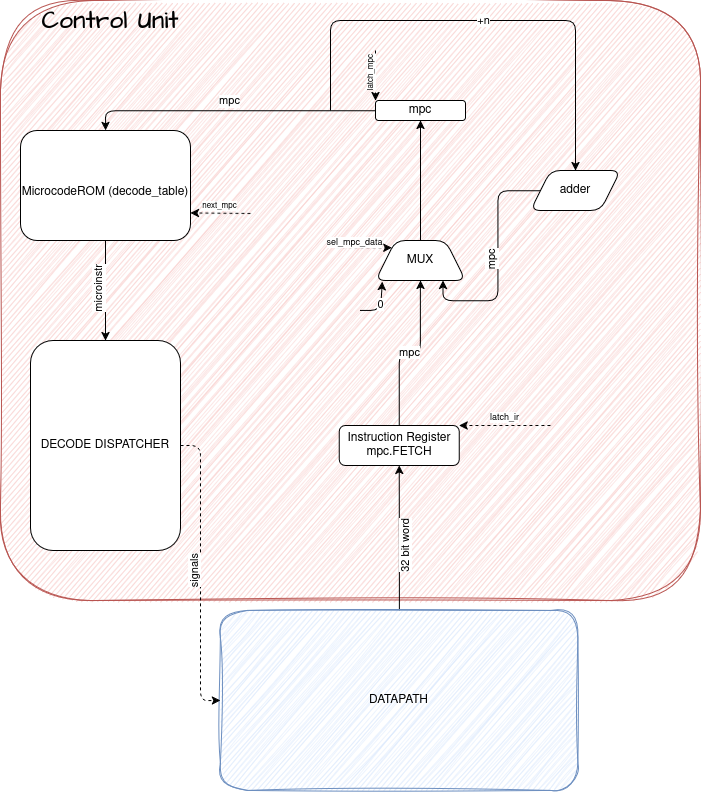

# RISCroll
```
                                       ____________________________
                                      /                           /\
                                     /                           / /\ 
                                    /     =================     / /
                                   /     /    RISC-V      /   / \/
                                  /     /    32-bit      /    /\
                                 /     /================/    / /
                                /___________________________/ /
                                \___________________________\/
                                 \ \ \ \ \ \ \ \ \ \ \ \ \ \ \
```
Лабораторная работа №4. Эксперимент

Молчанов Фёдор Денисович, P3213
`asm | risc | harv | mc | tick | binary | stream | mem | pstr | prob2 | vector`

## Язык программирования
### Синтаксис

```ebnf
<program>         ::= {<line> | <macro_def>}

<line>            ::= <label_line> | <code_line> | <comment_line>

<label_line>      ::= <label> [<comment>] <newline>

<code_line>       ::= [<label>] (<instruction> | <directive> | <macro_use>) [<comment>] <newline>

<comment_line>    ::= <comment> <newline>

<label>           ::= <identifier> ":"

<directive>       ::= "." <identifier> [<value_list>]

<value_list>      ::= <value> { "," <value> }

<value>           ::= <identifier> 
                        | <number> 
                        | <string>
                        | "high(" <identifier> ")"
                        | "low(" <identifier> ")"

<string>          ::= '"' { <any_char_except_quote> } '"'

<instruction>     ::= <r_type_instr>
                        | <i_arith_instr>
                        | <i_load_instr>
                        | <i_jump_instr>
                        | <s_type_instr>
                        | <b_type_instr>
                        | <u_type_instr>
                        | <j_type_instr>
                        | <sys_instr>

<r_type_instr>    ::= ("add" | "sub" | "mul" | "div" | "lsl" | "lsr" | "and" | "or" | "xor")
                     <reg> "," <reg> "," <reg>

<i_arith_instr> ::= ("addi" | "andi" | "ori")
                    <reg> "," <reg> "," <immediate>

<i_load_instr>  ::= "lw"
                    <reg> "," <offset> "(" <reg> ")"

<i_jump_instr>  ::= "jalr"
                    <reg> "," <offset> "(" <reg> ")"


<s_type_instr>    ::= ("sw") <reg> "," <offset> "(" <reg> ")"

<b_type_instr>    ::= ("beq" | "bne" | "bgt" | "ble" | )  <reg> "," <reg> "," <label_ref>

<u_type_instr>    ::= ("lui" | "auipc") <reg> "," <immediate>

<sys_instr>       ::= "halt"

<j_type_instr>    ::= "jal" <reg> "," <label_ref>

<comment>         ::= "#" { <any_char_except_newline> }

<reg>             ::= "$r" <number>         // $r0 to $r31

<offset>          ::= <number>
<immediate>       ::= <number>
<label_ref>       ::= <identifier>

<identifier>      ::= <letter> { <letter> | <digit> | "_" }

<number> ::= ["-"] (<decimal> | <hexadecimal>)

<decimal>     ::= <digit> {<digit>}
<hexadecimal> ::= "0x" <hex_digit> {<hex_digit>}

<hex_digit>   ::= <digit> | "a" | "b" | "c" | "d" | "e" | "f"
                             | "A" | "B" | "C" | "D" | "E" | "F"

<letter>          ::= "A" | ... | "Z" | "a" | ... | "z"
<digit>           ::= "0" | "1" | "2" | "3" | "4" | "5" | "6" | "7" | "8" | "9"

<macro_def> ::= ".macro" <identifier> [<macro_param_list>] <newline>
                { <line> }
                ".endm" <newline>

<macro_param_list> ::= <identifier> { "," <identifier> }

<macro_use> ::= <identifier> [<macro_arg_list>]

<macro_arg_list> ::= <value> { "," <value> }

```
##### Поддержка label-ов, секций и директивы .org.
Описанный синтаксис позволяет писать код как на полноценном асме.

Пример использования лейблов, секций и директивы .org:
```
.data
.org 0x0200
in_addr: .word 0x100

.text
.org 0x1000
main:
    halt
```


inc3 r5 # использование макроса inc3 в коде

```
### Регистры
| Register | Alias  | Description                       |
|----------|--------|-----------------------------------|
| `r0`    | `zero` | Constant zero                     |
| `r1`    | `ra`   | Return address                    |
| `r2`    | `sp`   | Stack pointer                     |
| `r3`    | `gp`   | Global pointer (optional)         |
| `r4`    | `tp`   | Thread pointer (optional)         |
| `r5`    | `t0`   | Temporary                         |
| `r6`    | `t1`   | Temporary                         |
| `r7`    | `t2`   | Temporary                         |
| `r8`    | `s0`   | Saved register / frame pointer    |
| `r9`    | `s1`   | Saved register                    |
| `r10`   | `s2`   | Saved register                    |
| `r11`   | `s3`   | Saved register                    |
| `r12`   | `s4`   | Saved register                    |
| `r13`   | `s5`   | Saved register                    |
| `r14`   | `s6`   | Saved register                    |
| `r15`   | `s7`   | Saved register                    |
| `r16`   | `a0`   | Function argument / syscall return |
| `r17`   | `a1`   | Function argument                 |
| `r18`   | `a2`   | Function argument                 |
| `r19`   | `a3`   | Function argument                 |
| `r20`   | `a4`   | Function argument                 |
| `r21`   | `a5`   | Function argument                 |
| `r22`   | `a6`   | Function argument                 |
| `r23`   | `a7`   | Syscall code                      |
| `r24`   | `t3`   | Temporary                         |
| `r25`   | `t4`   | Temporary                         |
| `r26`   | `t5`   | Temporary                         |
| `r27`   | `t6`   | Temporary                         |
| `r28`   | `x28`  | Reserved / custom use             |
| `r29`   | `x29`  | Reserved / custom use             |
| `r30`   | `x30`  | Reserved / custom use             |
| `r31`   | `x31`  | Reserved / custom use             |

### Стратегия вычислений
- Ассемблер соответствует строгой модели вычислений. Все аргументы вычисляются до применения к ним функций
- Язык не поддерживает выражения включающие в себя несколько ариф./логич. операций. Порядок выполнения операций определяет программист
- Все аргументы инструкций -- либо регистры, либо простые немодифицируемые значения (литералы), вычисляемые на этапе трансляции
- Все псевдо-функции (high(label), low(label)) раскрываются во время трансляции. Во время исполнения остаются только примитивные инструкции.

### Области видимости
В языке не существует как таковых областей видимости, однако есть пара моментов:
- Секция данных и команд не имеют прямого доступа друг к другу
- На аппаратном уровне невозможно прочитать команду из памяти команд как данные и наоборот
- Метки (label:) имеют глобальную область видимости, независимо от секции, в которой объявлены
- Имя не может быть повторно использовано для разных объектов (одна и та же строка не может быть и меткой, и макросом, и переменной)
- Разрешение символов производится до выполнения, на этапе трансляции (не динамически)

### Типизация, виды литералов
- .word — 32-битные значения
- .byte — 8-битные
- 0x литералы
- псевдо-функции high(), low()

## Организация памяти
- Процессор использует память с байтовой адресацией.
- Инструкции загрузки/сохранения (lw, sw) работают с 4-байтовыми словами.
- Непосредственные смещения в инструкциях памяти представляют собой 12-битные значения со знаком, что позволяет получить доступ к +-2048 байтам вокруг базового регистра.
- Модель памяти соответствует Гарвардской архитектуре
- Присутствует 3 вида памяти: Память инструкций, Память данных, Память микрокоманд

### Структура микрокода

Каждая микроинструкция (`MicroInstruction`) задаёт один такт выполнения инструкции. Ниже приведены поля и их описание:

|    Поле     |       Тип       |       Возможные значения       |                         Назначение                          |
| :---------: | :-------------: | :----------------------------: | :---------------------------------------------------------: |
| `latch_pc`  | `Optional[str]` |  `"inc"`, `"alu"`, `"branch"`  | Управление PC: инкремент, загрузка из ALU, условный переход |
| `latch_ir`  |     `bool`      |        `True` / `False`        |        Загрузить инструкцию из памяти по `PC` в `IR`        |
| `latch_reg` | `Optional[int]` |            `0..31`             |        Номер регистра, в который производится запись        |
| `latch_alu` | `Optional[str]` | `"add"`, `"sub"`, ..., `"lui"` |         ALU-операция, которая должна быть выполнена         |
| `latch_ar`  | `Optional[str]` |               —                |              Зарезервировано (не используется)              |
| `mem_read`  |     `bool`      |        `True` / `False`        |      Считать данные из `data_mem` по адресу `ALU_OUT`       |
| `mem_write` |     `bool`      |        `True` / `False`        |      Записать данные в `data_mem` по адресу `ALU_OUT`       |
| `set_flags` |     `bool`      |        `True` / `False`        |     Установить флаги `Z`, `N` на основе результата ALU      |
| `next_mpc`  | `Optional[int]` |       адрес микрокоманды       |        Адрес следующей микрокоманды в микропрограмме        |
|  `jump_if`  | `Optional[str]` | `"Z"`, `"NZ"`, `"GT"`, `"LE"`  |         Условие перехода (для `latch_pc="branch"`)          |
|   `halt`    |     `bool`      |        `True` / `False`        |                Остановить выполнение машины                 |
              |

#### Начальные микрокоманды

| MPC  | Комментарий       |                         Описание                          |
| ---- | ----------------- | :-------------------------------------------------------: |
| 0    | `FETCH`           |     Загрузка команды из `instr_mem` в `IR`, `PC += 4`     |
| 1    | `DECODE`          |            Переход к общей точке декодирования            |
| 1000 | `DECODE DISPATCH` | Поиск нужной микропрограммы по `(opcode, funct3, funct7)` |


### Извлечение инструкций
- Счетчик программ (PC) указывает на текстовую память.
- Инструкции имеют длину 4 байта (32 бита) и должны быть выровнены по словам.
- Процессор увеличивает PC на += 4 после каждой инструкции, если только не происходит переход.

### Доступ к данным
- Обращение к памяти разрешено только через регистры: все инструкции загрузки и сохранения (lw, sw) требуют адрес в регистре.
- Инструкция lw (load word) загружает 4 байта из памяти по адресу, содержащемуся в регистре.
- Инструкция sw (store word) записывает 4 байта по аналогичному адресу.
- Нельзя передавать непосредственные значения в lw/sw — только через lui/addi или адресные регистры.
- I\O адреса на данный момент строгие: input -- 0x1, output -- 0x2. В будущем у программиста будет возможность самому выбирать эти адреса

```
       Instruction memory
        +-----------------------------+
        |      Instruction Memory     |  <-- Только чтение (READ-ONLY)
        | 0x0000: bin instr           |
        | 0x0004: bin instr           |
        |  ...                        |
        +-----------------------------+

        +-----------------------------+
        |         Data Memory         |  <-- Чтение / Запись
        | 0x1000: user data           |
        | 0x1004: user data           |
        |  ...                        |
        +-----------------------------+

        +-----------------------------+
        |      Memory-mapped I/O      |
        | 0x1: IN_BUF                 |  <-- Только чтение
        | 0x2: OUT_BUF                |  <-- Только запись
        +-----------------------------+

        +-----------------------------+
        |     Microprogram Memory     |  <-- Только CU, сигналы управления
        | 0x0000: signals             |
        | 0x0001: signals             |
        |  ...                        |
        +-----------------------------+

```

## Система команд
#### Основные характерстики (features):
 - Длина инструкции строгая, 32 бит
 - Значения `opcode` и форматы инструкций взяты из оффициальной документации RISC-V
 - `jal` реализован прямо как в RISC-V, в том числе с учётом r0 как неиспользуемого регистра для записи. В таком случае `jal` будет использоваться как `goto <label>` без записи в регистр возврата. Диапазон значений, так как `imm value` 20 бит будет `[-2^31; 2^31 - 2^12] = [−2147483648, 2147479552]`
 - На каждую команду уходит минимум 2 такта на fetch и decode, дальше, в завис-ти от типа микропрограммы выполняется от 1 до ~3 микроинструкций.

#### Аббревиатуры:
- rs - source register
- rd - destination register
- opcode - operation code
- funct - function fields
- imm - immediate value 


|  Type  |       Example Instructions       | Opcode (bin) | Opcode (hex) |            Notes            |
| :----: | :------------------------------: | :----------: | :----------: | :-------------------------: |
| R-type | add, sub, mul, div, and, or, xor |  `0110011`   |    `0x33`    |   ALU register operations   |
| I-type |         addi, andi, ori          |  `0010011`   |    `0x13`    |      ALU immediate ops      |
| I-type |              lw, lb              |  `0000011`   |    `0x03`    |      Load instructions      |
| I-type |               jalr               |  `1100111`   |    `0x67`    |        Indirect jump        |
| S-type |                sw                |  `0100011`   |    `0x23`    |     Store instructions      |
| B-type |        beq, bne, blt, bge        |  `1100011`   |    `0x63`    |    Conditional branches     |
| U-type |               lui                |  `0110111`   |    `0x37`    |    Load upper immediate     |
| U-type |              auipc               |  `0010111`   |    `0x17`    | PC-relative upper immediate |
| J-type |               jal                |  `1101111`   |    `0x6F`    |  Unconditional jump + link  |
|  SYS   |               halt               |  `1111111`   |    `0x7F`    |     Custom system/halt      |

* `opcode` — всегда в `[6..0]`
* `funct3` — всегда в `[14..12]`
* `funct7` (если есть) — всегда в `[31..25]`

---
#### R-type инструкции

Формат:

|  funct7  |   rs2    |   rs1    |  funct3  |   rd    | opcode |
| :------: | :------: | :------: | :------: | :-----: | :----: |
| [31..25] | [24..20] | [19..15] | [14..12] | [11..7] | [6..0] |


Инструкции:

| Instruction | funct7  | funct3 | opcode (0x33) |    Description    |
| :---------: | :-----: | :----: | :-----------: | :---------------: |
|     add     | 0000000 |  000   |    0110011    | `rd = rs1 + rs2`  |
|     sub     | 0000000 |  001   |    0110011    | `rd = rs1 - rs2`  |
|     and     | 0000000 |  010   |    0110011    | `rd = rs1 & rs2`  |
|     or      | 0000000 |  011   |    0110011    | `rd = rs1 \| rs2` |
|     xor     | 0000000 |  100   |    0110011    | `rd = rs1 ^ rs2`  |
|     mul     | 0000000 |  101   |    0110011    | `rd = rs1 * rs2`  |
|     div     | 0000000 |  110   |    0110011    | `rd = rs1 / rs2`  |
|     lsl     | 0000000 |  111   |    0110011    | `rd = rs1 << rs2` |
|     lsr     | 0000001 |  000   |    0110011    | `rd = rs1 >> rs2` |

---

#### I-type инструкции

Формат:

| imm[11:0] |   rs1    |  funct3  |   rd    | opcode |
| :-------: | :------: | :------: | :-----: | :----: |
| [31..20]  | [19..15] | [14..12] | [11..7] | [6..0] |

Инструкции:

| Instruction | funct3 | opcode  |                   Description                    |
| :---------: | :----: | :-----: | :----------------------------------------------: |
|    addi     |  000   | 0010011 |                 `rd = rs1 + imm`                 |
|    andi     |  001   | 0010011 |                 `rd = rs1 & imm`                 |
|     ori     |  010   | 0010011 |                `rd = rs1 \| imm`                 |
|     lw      |  000   | 0000011 |   `rd = 32-bit word at mem[rs1 + offset]<br>`    |
|     lb      |  001   | 0000011 | ``rd ← sign-extended byte at mem[rs1 + offset]`` |
|    jalr     |  000   | 1100111 |            `PC = (rs1 + offset) & ~1`            |


---
#### S-type инструкции

Формат:

| imm[11:5] |   rs2    |   rs1    |  funct3  | imm[4:0] | opcode |
| :-------: | :------: | :------: | :------: | :------: | :----: |
| [31..25]  | [24..20] | [19..15] | [14..12] | [11..7]  | [6..0] |

Инструкции:


| Instruction | funct3 | opcode  |         Description          |
| :---------: | :----: | :-----: | :--------------------------: |
|     sw      |  000   | 0100011 |    `mem[rs1 + imm] = rs2`    |
|     sb      |  001   | 0100011 | `byte at mem[rs1+imm] = rs2` |

---
#### B-type инструкции

Формат:

| imm[12] | imm[10:5] |   rs2    |   rs1    |  funct3  | imm[4:1] | imm[11] | opcode |
| :-----: | :-------: | :------: | :------: | :------: | :------: | :-----: | :----: |
|  [31]   | [30..25]  | [24..20] | [19..15] | [14..12] | [11..8]  |   [7]   | [6..0] |


> После сборки все части immediate склеиваются обратно в 12-битный смещённый offset


Инструкции:

| Instruction | funct3 | opcode  |          Description          |
| :---------: | :----: | :-----: | :---------------------------: |
|     beq     |  000   | 1100011 | `if rs1 == rs2, PC += offset` |
|     bne     |  001   | 1100011 | `if rs1 != rs2, PC += offset` |
|     bgt     |  010   | 1100011 | `if rs1 > rs2, PC += offset`  |
|     ble     |  011   | 1100011 | `if rs1 <= rs2, PC += offset` |

---
#### U-type инструкции

Формат:

| imm[31:12] |   rd    | opcode |
| :--------: | :-----: | :----: |
|  [31..12]  | [11..7] | [6..0] |

Инструкции:

| Instruction | opcode  |   Description    |
| :---------: | :-----: | :--------------: |
|     lui     | 0110111 | `rd = imm << 12` |

---

#### J-type инструкции

Формат:

| imm[20] | imm[10:1] | imm[11] | imm[19:12] |   rd    | opcode |
| :-----: | :-------: | :-----: | :--------: | :-----: | :----: |
|  [31]   | [30..21]  |  [20]   |  [19..12]  | [11..7] | [6..0] |
> После склейки: `offset = {imm[20], imm[10:1], imm[11], imm[19:12]} << 1`

Инструкции:

| Instruction | opcode  |          Description          |
| :---------: | :-----: | :---------------------------: |
|     jal     | 1101111 | `rd = PC+4; PC = PC + offset` |

---
#### sys-type

Формат

| instruction | operands | opcode (bin) | opcode (hex) |    description     |
| :---------: | :------: | :----------: | :----------: | :----------------: |
|   `halt`    |    –     |  `1111111`   |    `0x7F`    | Custom system/halt |

## Транслятор

Трансляция происходит в несколько этапов:

1. **Первый проход (`first_pass`)**  
   - Пропуск комментариев (`#`).
   - Код разделяется на секции `.text` и `.data`, каждая со своей областью адресации (так как Гарвардская архитектура).
   - Обработка директив `.org`.
   - Выделяются и сохраняются метки (labels) вместе с их адресами.
   - Формируются два сегмента: `data_segment` и `text_segment`, содержащие пары `(адрес, строка`.

2. **Второй проход (`second_pass`)**  
   Здесь происходит собственно трансляция:
   - Каждая строка сегмента анализируется и превращается в числовое представление.
   - Метки с `.word` и `.byte` транслируются в память, будут находиться по адресу `out/<out_path>.data.bin`
   - Для инструкций `.text` используется парсер (`parse_line`) и энкодер (`encode`), который формирует 32-битный бинарный код в соответствии с описанием ISA.
   - Параллельно формируется отладочная информация: `(адрес, исходная строка, машинный код)`.

3. **Вывод бинарных файлов (`write_binaries`)**  
   - Полученные коды сохраняются в два отдельных бинарных файла:  
     - `.text.bin` — код программы (инструкции)  
     - `.data.bin` — начальное состояние памяти данных  
   - Также создаются отладочные текстовые дампы `.text.log` и `.data.log`, где каждая строка содержит:  
     `адрес — HEX — BIN — исходная строка`.

## Модель процессора
__RISC, lol?__
> На вход подается транслированный (через [translator.py](machine/translator.py)) бинарный файл, выходное название и (опционально) файл с входными данными.

Из [run_machine.py](run_machine.py):
```text
Usage: python run_machine.py <text_bin> <data_bin> [input_file]
```

Запуск транслятора:
```text
Usage: python machine/translator.py <asm file> <desired output file name>
```

Эмулятор может генерировать подробные логи (в `trace.log`) с построчной информацией:
- номер такта;
- состояние регистров;
- IR, PC, ALU_OUT, флаги;
- комментарии по действиям CU.
Это позволяет точно отследить поведение программы на уровне микрокоманд.

### Схемотехника
Особенности модели:
- Инструкции фиксированной длины (32 бита);
- 7 типов инструкций (R, I, S, B, U, J, SYS);
- Память Harvard-архитектуры (разделение команд и данных);
- Обработка ввода/вывода через отображённую память (memory-mapped I/O);
- Ограниченная система флагов (N, Z).

#### Datapath

Datapath состоит из:
- регистрa команд (IR);
- регистрa счётчика команд (PC);
- ALU (арифметико-логическое устройство);
- регистрoв общего назначения (32 x 32-битных);
- мультиплексоров для выбора входов ALU и адресации памяти;
- шины данных и адресов.



---

#### Control Unit

Control Unit реализован через микропрограммную память, где каждая микрокоманда определяет:
   - сигналы управления (чтение/запись, выбор регистра, операции ALU);
   - переход к следующей микрокоманде;
   - условия ветвления на основе флагов N/Z и типа инструкции.

Микропрограмма определяет точную последовательность шагов на каждом такте выполнения инструкции.




## ✅ Тестирование

Тестирование реализовано в виде **golden tests** — то есть каждый тестовый `.asm`-файл выполняется, и полученные выходные файлы сравниваются с заранее сохранёнными **эталонными результатами** (логи, снимки памяти и т.д.).

### 🔧 Используемые инструменты:

* [`pytest`](https://docs.pytest.org/) — для запуска и управления тестами;
* [`GitHub Actions`](https://docs.github.com/en/actions) — для автоматического CI на каждый `push` и `pull request`;
* `tests/expected/<name>/` — папки с ожидаемыми (золотыми) логами;
* `test_outputs/<name>/` — сохраняются логи каждого теста (всегда), даже при падении.

---

### Что проверяется в каждом тесте:

Для каждого алгоритма:

1. Выполняется трансляция `.asm` -> `.bin`;
2. Запускается `run_machine.py` на полученных файлах;
3. Сохраняются логи выполнения:
   * `trace.log` (микрошаги CU);
   * `final_snapshot.txt` (снимок регистров и памяти);
   * `out.text.log` (инструкции в hex и дизассемблированном виде);
   * `out.data.log` (дамп секции `.data`);
4. Выполненные логи сравниваются с `tests/expected/<test>/`.

---

### 🚀 Запуск тестов вручую

В корне проекта:

```bash
pytest -v
```

Тесты можно ограничить конкретным файлом или тестом:

```bash
pytest tests/test_algorithms.py::test_algorithm[hello_world]
```

---

### 💚 CI: GitHub Actions

Настроен CI workflow `.github/workflows/test.yml`:

* запускается при каждом `push` или `pull_request`;
* собирает и тестирует все `.asm`-файлы;
* падает, если хотя бы один результат не совпадает с ожидаемым.